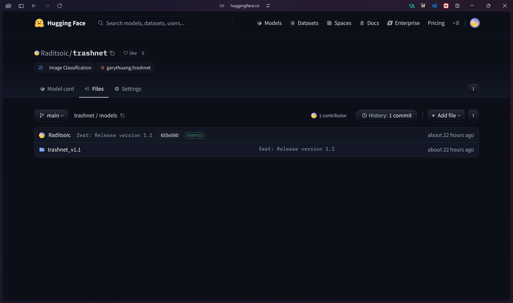
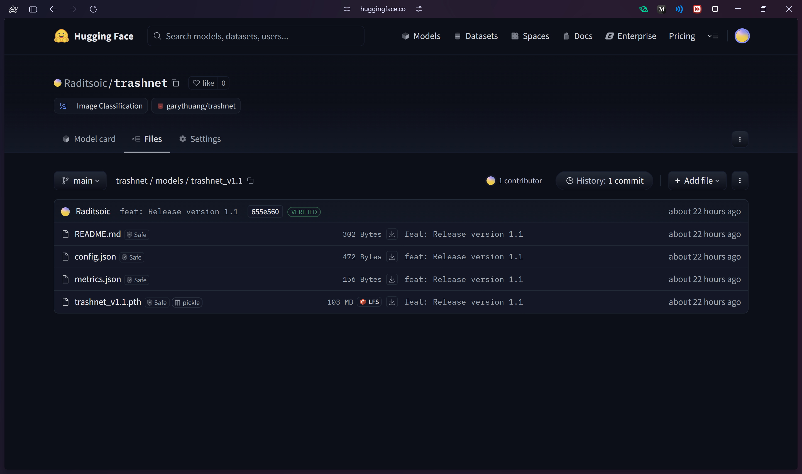
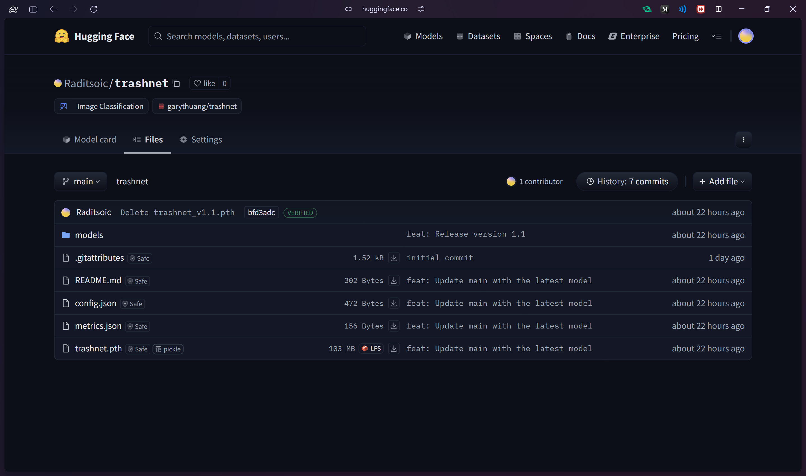
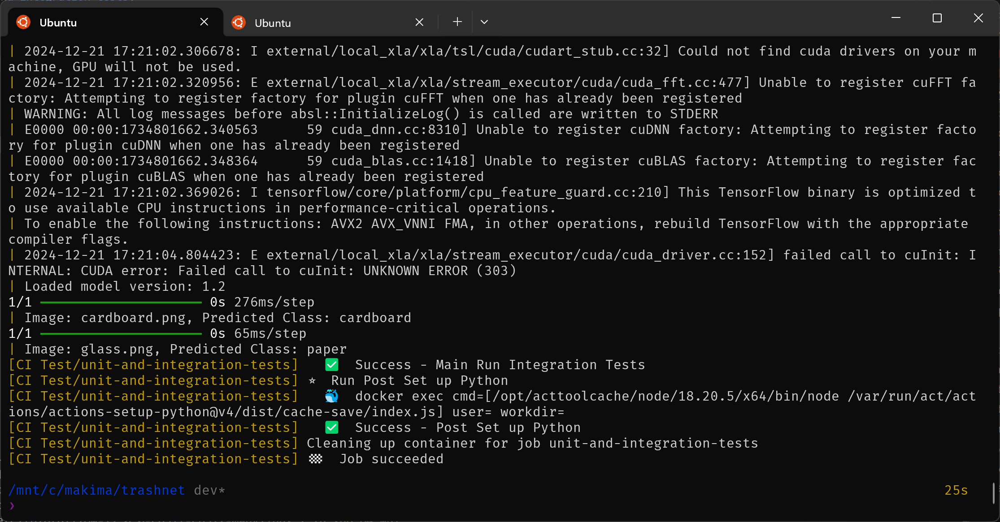
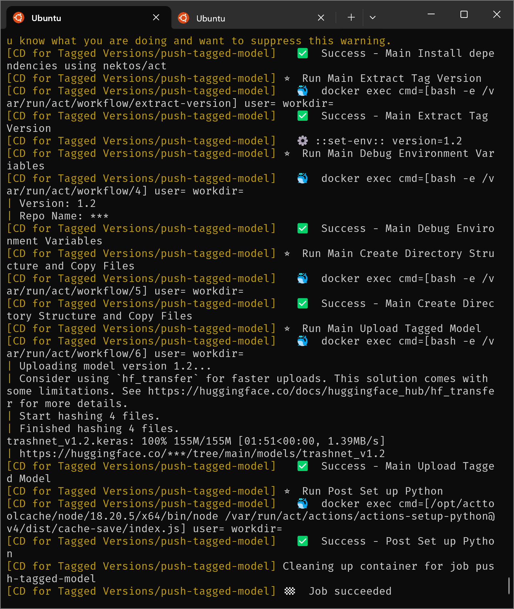
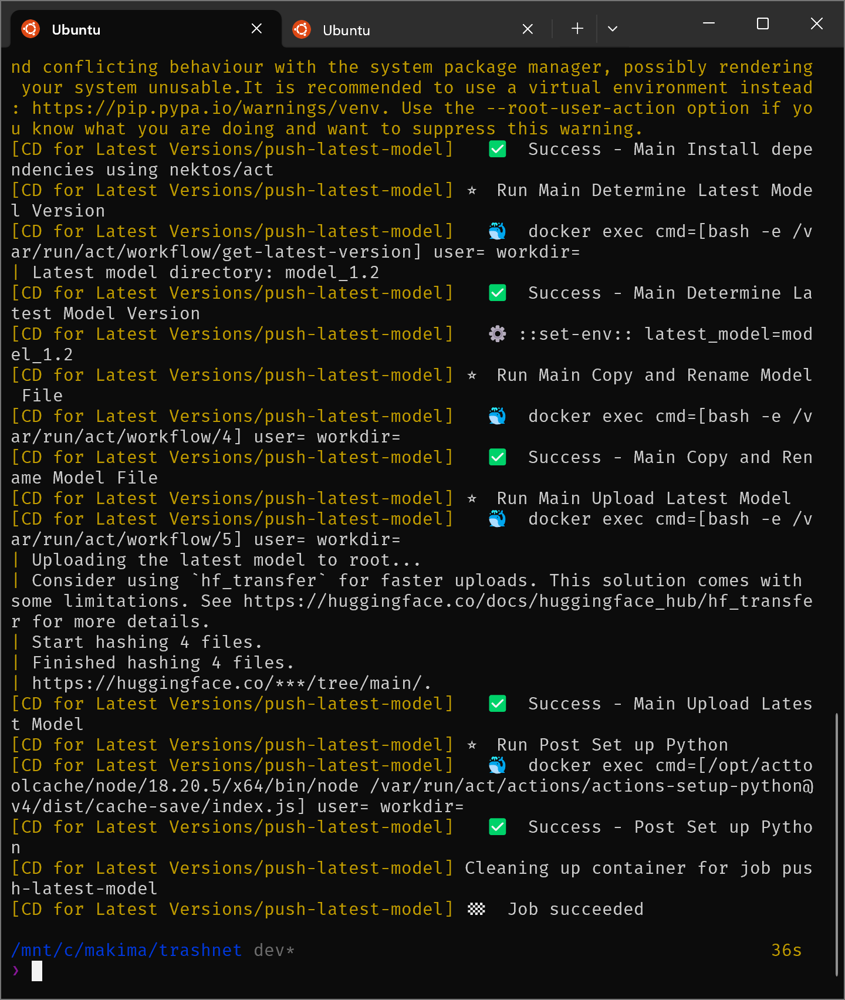

## Trashnet

### Project Structure Explanation

- **models**: save all models which need LFS for the models
- **notebooks**: model training experimentation
- **scripts**: script that runs certain functionality (ex: run training)
- **src**: all of the project functions
- **test**: Unit test and itegration test

### Environtment Setup

1. install Python
```sh
sudo add-apt-repository ppa:deadsnakes/ppa
sudo apt update
sudo apt install python3.12
```

2. setup virtual environtment
```sh
python3 -m venv venv
source venv/bin/activate
```

3. install depedencies
```sh
pip3 install -r requirements.txt
```

### Model Training Explanation

- Exploratory Image Analysis is explained in the <a src="github.com/raditsoic/trashnet/notebooks/dataset-analysis.ipynb">notebook</a>
- Modelling is explained in explained in the <a src="github.com/raditsoic/trashnet/notebooks/cnn_tensorflow.ipynb">notebook</a>

To run the training we can use:
```sh
python3 scripts/train_script.py
```

To adjust training parameters we can adjust it like this:
```sh
python3 scripts/train_script.py --epochs 50 --learning_rate 0.01
```

### Workflow Explanation

**Disclaimer**: To do this CI/CD we need `github lfs` because some of the model is 100MB++, and for the time being my github lfs bandwith is full. So i will do the demo with local testing github action with `nektos/act`.

Workflow will be split in 3 workflows, `ci.yml`, `cd-tag-ver.yml`, and  `cd-latest-ver.yml`

- **ci.yml - dev branch**:
    - usage:
        - integration test: Making sure model that has been pushed can be used for inference
    - trigger: `pull request dev`, `push dev`

- **cd-tag-ver.yml - tagged version branch**:
    - usage:
        - push tagged version: push tagged version to huggingface, example:
        ```sh
        git tag v1.1
        git push origin v1.1
        ```

        This will push the model and it's config to huggingface.
        |  |  |
        |-----------------------------------------------------------|-----------------------------------------------------------|
    - trigger: `tag v1.x` -> `push v1.x`
    
- **cd-latest-ver.yml - main branch**:
    - usage:
        - push latest model: push latest model to the root directory of huggingface repository.
    - trigger: `pull request main`, `push main`
        

### Workflow nektos/act (Optional Run workflow locally to avoid github LFS)

Because of the limitation of github lfs, i use `nektos/act cli` and docker to simulate github action to automate model CI/CD. To simulate it locally we can:

1. Install `nektos/act`
    ```sh
    curl https://raw.githubusercontent.com/nektos/act/master/install.sh | sudo zsh
    ```

2. Add `act` path
    ```sh
    'export PATH="$PATH:$(pwd)/bin"' >> ~/.zshrc
    source ~/.zshrc
    ```

3. Copy `.secret` and change token to simulate Github Secrets
    ```sh
    cp .secrets.example .secrets
    ```

4. Run jobs
    ```sh
    act -j <job-name> --secret-file .secrets
    ```

#### Demo


<p align="center"><b>ci.yml</b></p>


<p align="center"><b>cd-tag-ver.yml</b></p>


<p align="center"><b>cd-latest-ver.yml</b></p>

#### What could be better that i haven't implement?

In terms of workflow, because of the limitation of `github LFS`, we could use another ML model storage like `dvc`. `dvc` is a dedicated AI/ML storage. Unfortunately, for this time i haven't implement it.